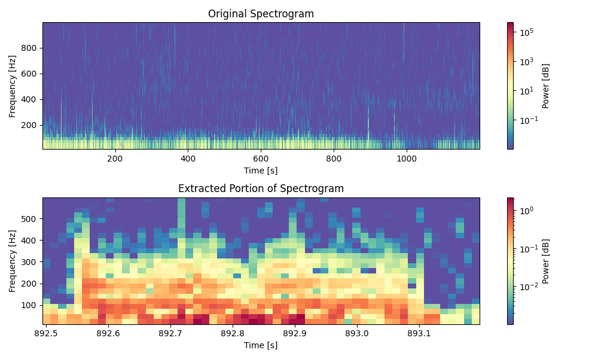

# SEALS Project Notebook

This repository contains tools and resources for analyzing and visualizing spectrogram data from seal vocalizations. The project focuses on processing audio data, generating spectrograms, and performing exploratory data analysis to study different types of seal calls.

## Project Structure

```
.gitignore
g_rupe_spectrogram.png   # Example spectrogram image
Pipfile                  # Pipenv configuration for managing dependencies
Pipfile.lock             # Lock file for Pipenv dependencies
README.md                # Project documentation
seals_spectogram.ipynb   # Main Jupyter Notebook for analysis
spectrogram.png          # Example spectrogram image

```

### Data Directories:
- **`data/Guttural rupe/`**: Contains raw audio files and selection tables for "Guttural rupe" calls.
- **`data/Moan/`**: Contains raw audio files and selection tables for "Moan" calls.
- **`data/Rupes A and B/`**: Contains raw audio files and selection tables for "Rupes A and B" calls.
- Duplicate the `Guttaral rupe`, `Moan`, and `Rupes A and B` into the **`root directory`** for generating spectograms.

---

## Requirements

- Python 3.10 or higher
- Pipenv (recommended for environment management to avoid dependency conflicts)

---

##  Setup Instructions

### 1. Clone the Repository
```bash
git clone https://github.com/Yashwanthjamala/seals_project.git
cd seals_project
```

### 2. Create the Virtual Environment
```bash
pipenv install
```

### 3. Activate the Environment
```bash
pipenv shell
```

### 4. Set up the data

- **`data/Guttural rupe/`**: Contains raw audio files and selection tables for "Guttural rupe" calls.
- **`data/Moan/`**: Contains raw audio files and selection tables for "Moan" calls.
- **`data/Rupes A and B/`**: Contains raw audio files and selection tables for "Rupes A and B" calls.

>**Note:** Following the exam instructions, keep the data in the root directory too to run the spectograms.


### 5. Launch Jupyter Notebook
```bash
jupyter notebook seals_spectogram.ipynb
```

---

## Features

- **Spectrogram Generation**: Visualize audio data as spectrograms for analysis.
- **Data Annotation**: Use selection tables to annotate and analyze specific audio segments.
- **Exploratory Data Analysis**: Perform statistical and visual analysis of seal vocalizations.
- **Machine Learning**: Train models to classify or analyze seal calls (future scope).

---

## Notebook

### `seals_spectogram.ipynb`
The main notebook for processing audio data, generating spectrograms, and performing exploratory analysis, modeling, evaluation, and fine-tuning

---

## Example Outputs

### Spectrogram Example


---


## License

This project is licensed under the [MIT License](LICENSE). Feel free to use, modify, and distribute this project as per the license terms.

---

## Contact

For questions or collaboration, please contact [your-email@example.com](mailto:your-email@example.com).